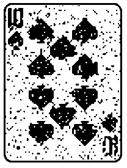

Binary-graph-cuts
=================

#Introduction

A C++ implementation of the Algorithm 12.1, *Binary graph cuts*, as found in the [*Algorithm Booklet*](http://www.cs.ucl.ac.uk/staff/s.prince/book/Algorithms.pdf) by [Simon J.D. Prince](http://www0.cs.ucl.ac.uk/staff/s.prince/).

The Algorithm Booklet is a companion to the book [*Computer Vision: Models, Learning, and Inference*](http://www.computervisionmodels.com/) by Simon J.D. Prince.

The maximum flow algorithm is [MAXFLOW version 3.03](http://pub.ist.ac.at/~vnk/software/maxflow-v3.03.src.zip) based on the paper:

[BOYKOV, Yuri; KOLMOGOROV, Vladimir. An experimental comparison of min-cut/max-flow algorithms for energy minimization in vision. *Pattern Analysis and Machine Intelligence, IEEE Transactions on*, 2004, 26.9: 1124-1137.](http://ieeexplore.ieee.org/xpl/login.jsp?tp=&arnumber=1316848&url=http%3A%2F%2Fieeexplore.ieee.org%2Fxpls%2Fabs_all.jsp%3Farnumber%3D1316848)

Tested with OpenCV version 2.4.4.

#Demo

The following command line

`./binary_graph_cuts fig_12.12.png no`

applies the denoising algorithm to the left image in order to get the right image:

 

